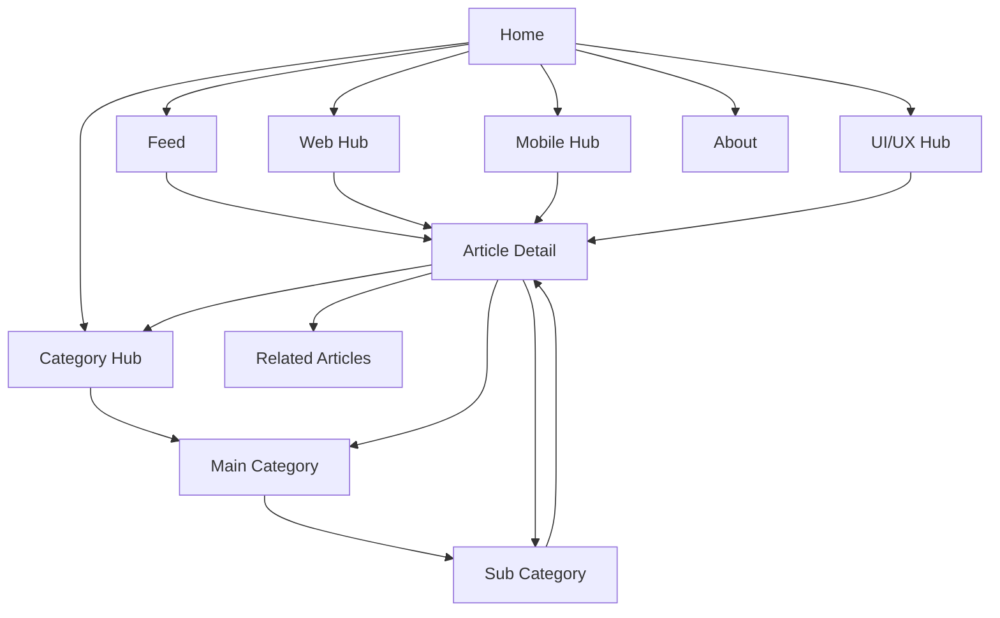
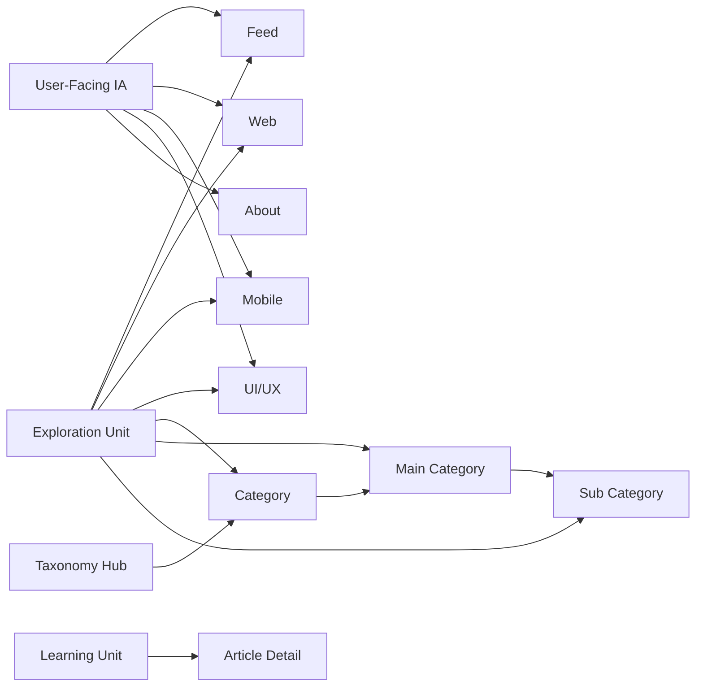

# Docs App Information Architecture

## Purpose

이 문서는 `apps/docs`의 정보구조를 제품 관점에서 확정하기 위한 기준 문서입니다.

이 문서는 다음 질문에 답하도록 작성합니다.

- 이 블로그는 왜 존재하는가
- 사용자는 어떤 기대를 가지고 각 페이지에 들어오는가
- `Feed / Web / Mobile / UI/UX / About / Category`는 각각 어떤 역할을 가져야 하는가
- `/feed`와 `/docs`는 어떻게 다른가
- 허브 페이지와 상세 페이지는 무엇이 다른가
- 각 페이지에는 어떤 정보를 보여줘야 하고, 어떤 정보는 오히려 덜어내야 하는가

이 문서는 앞으로 다음 작업의 기준이 됩니다.

- 홈/허브/상세 화면 UX 설계
- 카테고리 구조 확장
- 편집 정책과 콘텐츠 운영 우선순위 결정
- 네비게이션과 내부 링크 정책 정리

## Blog Mission

`docs` 앱은 단순히 글을 쌓는 개발 블로그가 아니라, 기술과 제품 경험을 함께 설명하는 지식 허브를 목표로 합니다.

핵심 목적은 다음과 같습니다.

1. 기술 지식을 축적한다.
   - 웹, 모바일, UI/UX, 컴퓨터 과학 관련 학습 내용을 구조적으로 축적한다.

2. 학습 결과를 재사용 가능한 형태로 정리한다.
   - 단발성 메모가 아니라, 다른 사람이 읽어도 이해 가능한 문서 단위로 정리한다.

3. 기술 구현과 제품 사고를 함께 보여준다.
   - 코드 중심 주제뿐 아니라 정보구조, 인터랙션, 디자인 시스템, 사용자 경험 사고도 함께 다룬다.

4. 탐색 가능한 콘텐츠 경험을 만든다.
   - 사용자가 최신 글을 발견할 수도 있고, 특정 주제로 깊게 들어갈 수도 있게 한다.

즉 이 블로그의 목적은:

- `최신 글 모음`만 제공하는 것도 아니고
- `정적인 문서 보관소`에 머무르는 것도 아니라
- `탐색 가능한 기술/제품 지식 구조`를 만드는 것입니다.

## Product Principles

정보구조를 설계할 때 따르는 원칙은 아래와 같습니다.

1. 사용자의 언어를 우선한다.
   - `Web / Mobile / UI/UX / About` 같은 메뉴는 사용자가 직관적으로 이해할 수 있어야 한다.

2. 분류 체계보다 탐색 목적을 먼저 둔다.
   - 사용자는 먼저 “무엇을 읽을지”를 고르고, 그 다음 “어떻게 분류됐는지”를 따라간다.

3. 허브 페이지와 상세 페이지의 역할을 섞지 않는다.
   - 허브는 선택과 방향 제시
   - 상세는 학습과 이해

4. 첫 화면은 장식보다 탐색을 돕는다.
   - 시각 효과보다 “어디로 갈 수 있는가”가 먼저 보이도록 한다.

5. `Category`는 사용자-facing 메인 목적지가 아니라 taxonomy 허브로 둔다.
   - 메인 메뉴의 주인공은 `Feed / Web / Mobile / UI/UX / About`
   - `Category`는 내부 구조 탐색을 돕는 보조 허브

## Core IA Decision

현재 `docs` 앱의 정보구조는 아래처럼 해석합니다.

- `Feed / Web / Mobile / UI/UX / About`는 사용자-facing IA
- `Category`는 taxonomy 허브
- 상세 페이지는 학습 단위
- 허브 페이지는 탐색 단위

이 결정의 의미는 다음과 같습니다.

### User-Facing IA

사용자가 상단 내비게이션이나 홈 진입을 통해 직접 인지하는 구조입니다.

- `Feed`
- `Web`
- `Mobile`
- `UI/UX`
- `About`

이 구조는 사용자의 질문에 답합니다.

- “지금 뭐가 새로 올라왔지?”
- “웹 관련 글만 보고 싶다”
- “모바일 쪽만 모아 보고 싶다”
- “이 사이트는 어떤 관점의 글을 쓰지?”

### Taxonomy Hub

`Category`는 사용자-facing 메인 IA보다 한 단계 아래의 분류 허브입니다.

이 구조는 시스템 질문에 더 가깝습니다.

- “콘텐츠가 어떻게 분류되어 있지?”
- “메인 카테고리 아래에 어떤 서브토픽이 있지?”

즉 `Category`는 메인 홈 역할이 아니라:

- sidebar 탐색
- hero preview 진입
- 관련 토픽 이동

을 위한 보조 구조로 두는 편이 적절합니다.

## Information Architecture Diagram

## Navigation Model

### Primary Navigation

상단 내비게이션은 사용자-facing 목적지 중심으로 유지합니다.

- `Feed`
- `Web`
- `Mobile`
- `UI/UX`
- `About`

이 레벨에서는 사용자가 “무슨 종류의 콘텐츠를 보러 왔는지”를 고릅니다.

### Secondary Navigation

보조 탐색은 콘텐츠 구조와 연관 관계를 설명합니다.

- `Category`
- sidebar category tree
- related topic links
- same-category navigation

이 레벨에서는 사용자가 “어떤 분류/세부 주제로 이동할지”를 고릅니다.

### Document Access Layer

`/docs`는 메인 user-facing IA와는 조금 다른 역할을 갖습니다.

- `/feed`가 “무엇을 발견할지”를 돕는다면
- `/docs`는 “전체 문서를 어떻게 찾을지”를 돕습니다

즉 `/docs`는 별도의 메인 허브라기보다:

- 문서 인덱스
- 검색 결과 컨텍스트

로 보는 편이 적절합니다.

## Page Roles

### `Home`

역할:

- 블로그의 첫인상을 제공한다.
- 콘텐츠 방향을 빠르게 이해시킨다.
- 주요 허브로 진입하게 만든다.

보여줘야 할 것:

- 블로그의 성격을 설명하는 짧은 소개
- `Web / Mobile / UI/UX / Category`로 이어지는 명확한 진입점
- 최신 콘텐츠나 대표 콘텐츠 preview

과도하게 두지 말아야 할 것:

- 복잡한 분류표
- 깊은 필터 UI
- 장식성만 강한 인터랙션

### `Feed`

역할:

- 전체 콘텐츠의 흐름을 빠르게 보여준다.
- 새로 올라온 글, 추천할 만한 글, 최근 업데이트를 발견하게 만든다.

사용자 기대:

- “지금 볼만한 글이 뭐지?”
- “최근 업데이트가 뭔지 한 번에 보고 싶다”

보여줘야 할 것:

- 최신 글 목록
- 추천/큐레이션 섹션
- 최근 업데이트
- 시리즈 또는 읽기 흐름 제안

덜어내야 할 것:

- 지나치게 복잡한 taxonomy 설명
- 허브 페이지 수준의 장황한 소개

### `/docs`

역할:

- 전체 문서를 빠르게 스캔하는 인덱스
- 검색 결과를 보여주는 컨텍스트

사용자 기대:

- “전체 문서를 한 번에 보고 싶다”
- “검색 결과만 따로 보고 싶다”

보여줘야 할 것:

- 전체 문서 목록
- 검색 결과 상태
- 추천 검색어
- 빠른 스캔 중심의 카드 리스트

`/docs`는 `Feed`와 같은 데이터 일부를 공유할 수 있지만, 같은 목적의 화면이면 안 됩니다.

### `Web`

역할:

- 웹 엔지니어링 관련 콘텐츠 허브

사용자 기대:

- “프론트엔드, 브라우저, 렌더링, 프레임워크 쪽 글만 모아보고 싶다”

보여줘야 할 것:

- 웹 관련 대표 토픽
- 추천 문서
- 입문/심화 흐름
- 최신 웹 관련 업데이트

대표 콘텐츠 범위:

- frontend fundamentals
- React / Router / Astro / Svelte
- rendering / browser / performance
- accessibility

### `Mobile`

역할:

- 모바일 개발 관련 콘텐츠 허브

사용자 기대:

- “모바일 개발 관점의 글을 따로 보고 싶다”

보여줘야 할 것:

- 모바일 관련 주제 개요
- 대표 문서 또는 준비 중인 핵심 시리즈
- 플랫폼/경험/구현 관점의 토픽 안내

대표 콘텐츠 범위:

- React Native
- mobile architecture
- app UX
- device constraints
- release/performance topics

현재 콘텐츠가 적다면:

- 빈 허브처럼 보이지 않게 curated preview를 먼저 두고
- 실제 문서가 늘어날수록 허브형 구조를 강화합니다.

### `UI/UX`

역할:

- 제품 인터페이스, 정보구조, 디자인 시스템, UX 사고 관련 허브

사용자 기대:

- “코드만이 아니라 인터페이스 설계와 사용자 경험 관점의 글도 보고 싶다”

보여줘야 할 것:

- design system
- component thinking
- information architecture
- interaction design
- usability / onboarding / product UX

핵심 차별점:

- `Web`이 구현 중심이라면
- `UI/UX`는 경험과 구조 중심

### `About`

역할:

- 이 블로그가 왜 존재하는지 설명한다.
- 운영자 관점과 콘텐츠 방향을 보여준다.
- 신뢰를 형성한다.

보여줘야 할 것:

- 블로그 운영 목적
- 다루는 주제
- 글의 스타일과 원칙
- 향후 확장 방향

`About`은 홍보 페이지라기보다 “이 지식 허브의 운영 맥락”을 설명하는 페이지로 보는 편이 좋습니다.

### `Category`

역할:

- 내부 taxonomy를 드러내는 보조 허브

사용자 기대:

- “세부 분류를 기준으로 글을 찾고 싶다”

보여줘야 할 것:

- 메인 카테고리
- 서브 카테고리
- 카테고리별 문서 수
- 최근 업데이트
- 인기 토픽

`Category`는 메인 IA의 대체물이 아니라, 더 세밀한 탐색을 위한 보조 계층입니다.

## Hub Pages vs Detail Pages

### Hub Pages

허브 페이지는 탐색 단위입니다.

질문:

- “이 섹션에서는 무엇을 읽을 수 있지?”
- “어디서 시작하면 좋지?”

역할:

- 방향 제시
- 주제 요약
- 대표 진입점 제공

구성:

- 섹션 소개
- 대표 토픽
- 추천 문서
- 최근 업데이트
- 입문/심화 흐름

대표 예:

- `Feed`
- `/docs`
- `Web`
- `Mobile`
- `UI/UX`
- `Category`
- `/category/[main]`
- `/category/[main]/[sub]`

### Detail Pages

상세 페이지는 학습 단위입니다.

질문:

- “이 주제를 정확히 이해하려면 무엇을 읽어야 하지?”
- “이 글에서 실제로 무엇을 배우게 되지?”

역할:

- 하나의 주제를 깊게 전달
- 맥락과 예시 제공
- 관련 문서로 이어주기

구성:

- 제목
- 본문
- TOC
- 관련 글
- 같은 주제/카테고리로의 이동

대표 예:

- `/docs/[slug]`
- `/category/[main]/[sub]/[slug]`

## What To Show On Each Page

이 섹션은 실제 UI 설계와 편집 기준에서 바로 참고할 수 있도록 작성합니다.

### 공통 원칙

모든 허브 페이지는 아래 질문에 답해야 합니다.

1. 이 페이지는 무엇을 다루는가
2. 여기서 무엇을 읽을 수 있는가
3. 어디서 시작하면 좋은가
4. 다음으로 어디로 이동할 수 있는가

### 허브 페이지 공통 구성

- title
- short description
- representative topics
- recommended articles
- latest updates
- next navigation

### 상세 페이지 공통 구성

- title
- article body
- toc
- related articles
- back-to-hub navigation
- same-topic navigation

## Recommended Content Display Policy

실제 각 화면에 어떤 정보를 우선적으로 노출해야 할지는 아래 기준을 따릅니다.

### 우선순위 1: 사용자 행동을 돕는 정보

- 추천 문서
- 최신 업데이트
- 대표 토픽
- 다음 이동 경로

### 우선순위 2: 맥락을 설명하는 정보

- 섹션 설명
- 카테고리 설명
- 이 글이 왜 중요한지에 대한 짧은 문장

### 우선순위 3: 운영 메타데이터

- 날짜
- 문서 수
- 카테고리 라벨
- 업데이트 상태

원칙:

- 메타데이터는 보조 정보입니다.
- 문서 수나 날짜는 유용하지만, 콘텐츠 선택을 방해할 정도로 전면에 나오면 안 됩니다.

## User Flows

### First-Time Visitor

`Home -> Feed or Hub -> Article Detail`

목표:

- 사이트가 무엇을 다루는지 이해
- 흥미 있는 영역 선택
- 대표 문서 읽기

### Goal-Oriented Visitor

`Web or Mobile or UI/UX -> Topic -> Article Detail`

목표:

- 특정 분야의 글만 빠르게 탐색

### Taxonomy-Oriented Visitor

`Category -> Main Category -> Sub Category -> Article Detail`

목표:

- 분류 기준으로 깊게 탐색

### Trust-Seeking Visitor

`About -> Feed or Hub`

목표:

- 운영 목적과 관점을 이해한 뒤 콘텐츠 소비 시작

## IA Diagram By Role

## Decision Summary

최종적으로 `docs` 앱의 정보구조는 아래처럼 해석합니다.

1. `Feed / Web / Mobile / UI/UX / About`는 사용자-facing IA다.
2. `Category`는 taxonomy 허브다.
3. `/docs`는 문서 인덱스 및 검색 컨텍스트다.
4. 허브 페이지는 탐색 단위다.
5. 상세 페이지는 학습 단위다.
6. 허브 페이지는 “무엇을 읽을 수 있는가”를 설명해야 한다.
7. 상세 페이지는 “무엇을 배울 수 있는가”를 설명해야 한다.
8. 메타데이터보다 탐색과 콘텐츠 선택을 우선한다.

## Follow-Up

이 문서를 기준으로 다음 작업을 진행합니다.

- home hero / feed / hub 페이지의 노출 정보 점검
- `Mobile` 허브용 실제 콘텐츠 초안 작성
- `UI/UX` 허브의 실제 문서 연결 구조 보강
- `Category`와 user-facing hub 사이의 연결 방식 세부 조정
