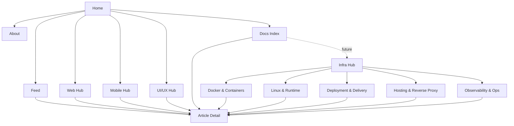

# Infra Channel Evaluation

## Purpose

이 문서는 `Docker`, `Linux`, `배포`, `운영`, `관측성`, `호스팅`, `CI/CD` 같은 인프라 주제를 `apps/docs` 안에서 어떻게 다룰지 정리합니다.

이 문서는 다음 질문에 답하도록 작성합니다.

- `Infra`를 상단 내비게이션에 바로 추가해야 하는가
- `Web / Mobile / UI/UX`와 어떤 관계로 두는 것이 좋은가
- 언제 하위 분류로 두고, 언제 독립 허브나 탭으로 승격해야 하는가
- `Systems`나 `Computer Science`와는 어떻게 구분하는가

## Current Judgment

현재 시점에서 `Infra`는 `Computer Science`보다 top-level 메뉴 후보로 더 적합합니다.

이유는 다음과 같습니다.

1. 주제 묶음이 사용자에게 더 직관적입니다.
   - `Docker`
   - `Linux`
   - `Deployment`
   - `Observability`
   - `Self-hosting`

2. 현재 블로그의 실무 엔지니어링 톤과 잘 맞습니다.
   - `Web / Mobile / UI/UX`가 구현/제품/경험 축이라면
   - `Infra`는 운영/배포/실행 환경 축으로 자연스럽게 이어집니다.

3. 사용자의 탐색 목적이 비교적 분명합니다.
   - “프론트 구현 글”을 보려는 사람과
   - “Docker/Nginx/Linux/배포” 글을 보려는 사람은
   - 읽기 목적이 꽤 다를 가능성이 큽니다.

다만 `좋은 주제`인 것과 `지금 즉시 top-level 탭으로 올리는 것`은 같은 판단이 아닙니다.

## Recommended Rollout

권장 순서는 아래와 같습니다.

### 1. 하위 분류로 먼저 검증

우선은 `docs`와 `feed` 안에서 하위 분류로 검증합니다.

예:

- `INFRA`
- `DOCKER`
- `LINUX`
- `DEPLOYMENT`
- `OBSERVABILITY`
- `SELF-HOSTING`

이 단계에서 확인할 것:

- 실제로 문서가 꾸준히 쌓이는가
- `Web` 글과 `Infra` 글이 피드에서 자연스럽게 구분되는가
- 사용자가 인프라 주제를 하나의 묶음으로 소비하는가

### 2. 독립 허브로 실험

문서가 일정량 쌓이면, 상단 탭 전에 별도 허브를 실험합니다.

예:

- `/infra`

이 페이지는 아래를 묶는 editorial hub가 될 수 있습니다.

- Docker & Containers
- Linux & Runtime Environments
- Deployment & Delivery
- Hosting & Reverse Proxy
- Monitoring & Operations

이 단계의 목적은 `탭 승격`이 아니라, `정말 독립된 사용자 목적지가 되는지`를 검증하는 것입니다.

### 3. top-level 탭 승격 여부 결정

아래 조건이 맞으면 그때 `Infra`를 상단 탭으로 승격할 수 있습니다.

1. 문서량이 충분하다.
   - 최소 5~10개 이상의 독립 문서가 있고, 일회성 시도가 아니다.

2. 기존 `Web` 채널과 읽기 목적이 명확히 다르다.
   - 예: React/브라우저/렌더링은 `Web`
   - 예: Docker/Nginx/Linux/NAS/배포 자동화는 `Infra`

3. 허브 페이지로서도 충분한 밀도를 가진다.
   - featured article
   - recent notes
   - topic clusters
   - setup / operations reading paths

4. 상단 내비게이션 복잡도를 감수할 가치가 있다.
   - 탭을 추가해도 전체 IA가 더 쉬워지는가
   - 아니면 단지 메뉴만 늘어나는가

## Boundary Rule

`Infra`를 추가할 때 가장 중요한 것은 `Web`, `Computer Science`, `Systems`와의 경계를 명확히 두는 것입니다.

### `Web`

- 브라우저
- 프론트엔드 프레임워크
- 렌더링
- 컴포넌트 구조
- 웹 런타임과 사용자-facing 구현

### `Infra`

- 배포
- 컨테이너
- 서버 운영
- reverse proxy
- self-hosting
- observability
- delivery pipeline

### `Computer Science`

- 운영체제 이론
- 네트워크 기초
- 메모리/프로세스/스레드
- 자료구조와 알고리즘

### `Systems`

`Systems`는 지금 구조에서는 umbrella label 또는 theme에 가깝고, top-level 채널명으로 쓰기에는 다소 모호할 수 있습니다.

따라서 실제 메뉴명은:

- `Systems`
  보다는
- `Infra`

가 더 사용자 친화적입니다.

## IA Options

### Option A

`Infra`를 독립 허브로 두되 상단 탭은 아직 추가하지 않는다.

장점:

- IA 충격이 작다
- 콘텐츠 밀도 검증이 쉽다
- 나중에 탭 승격이 가능하다

단점:

- 발견성이 top-level 탭보다 낮다

### Option B

`Infra`를 `Web` 하위 editorial group으로 잠시 둔다.

예:

- frontend deployment
- browser-serving infrastructure
- nginx / caching / static delivery

장점:

- 현재 채널 구조를 크게 건드리지 않는다
- 웹 엔지니어링의 연장선으로 설명하기 쉽다

단점:

- Docker, Linux, NAS, self-hosting처럼 웹 밖으로 확장되는 주제가 `Web` 안에 갇혀 보일 수 있다

### Option C

바로 상단 탭으로 추가한다.

장점:

- 발견성이 가장 높다
- 장기적으로 독립 채널이 될 의지가 분명하다

단점:

- 콘텐츠 밀도 부족 시 빈 허브처럼 보일 수 있다
- `Web / Mobile / UI/UX`와의 상대적 우선순위 조정이 필요하다

## Recommendation

현재 추천은 `Option A`입니다.

즉:

- 먼저 하위 분류로 운영
- 필요하면 `/infra` 독립 허브를 실험
- 충분한 콘텐츠와 사용자 목적이 확인되면 top-level 승격

이 순서가 가장 안전합니다.

## Suggested Scope

초기 범위는 아래 정도가 적절합니다.

- Docker
- Linux runtime
- deployment pipeline
- self-hosting / NAS
- reverse proxy / gateway
- monitoring / logging / operations notes

반면 아래는 너무 이른 범위 확장일 수 있습니다.

- 별도 `Cloud` 탭 분리
- 별도 `Security` 탭 분리
- 별도 `SRE` 탭 분리

처음에는 `Infra` umbrella 아래에서 밀도를 만든 뒤 다시 세분화하는 편이 낫습니다.

## Information Architecture Diagram

## Proposed Menu Evolution

### Stage 1

현재 메뉴 유지:

- `Feed`
- `Web`
- `Mobile`
- `UI/UX`
- `About`

`Infra`는 분류와 링크 수준에서만 운영

### Stage 2

독립 허브 추가:

- `/infra`

하지만 상단 탭에는 아직 올리지 않음

### Stage 3

문서량과 허브 밀도가 충분해지면:

- `Feed`
- `Web`
- `Mobile`
- `UI/UX`
- `Infra`
- `About`

구성으로 승격 검토

## Decision Rule

요약하면:

- `문서 수가 적고 아직 실험 단계`
  - 하위 분류 유지
- `문서 수가 늘고 묶음으로 읽히기 시작함`
  - `/infra` 허브 실험
- `독립 허브도 충분히 작동함`
  - 상단 탭 승격 검토

한 줄 결론:

`Infra`는 top-level 메뉴 후보로 충분히 좋지만, 지금은 바로 추가하기보다 하위 분류 -> 독립 허브 -> top-level 승격 순서가 가장 적절합니다.
