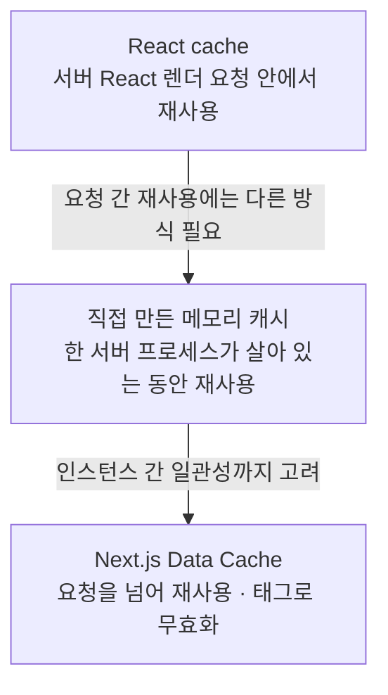
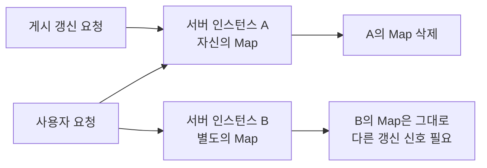
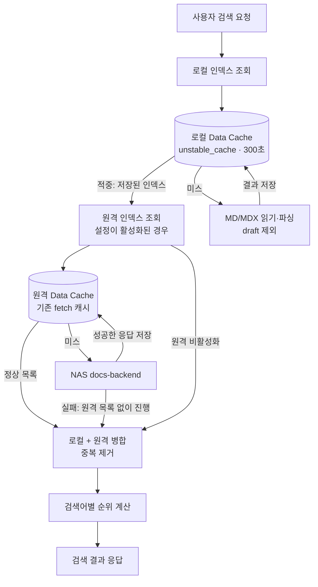
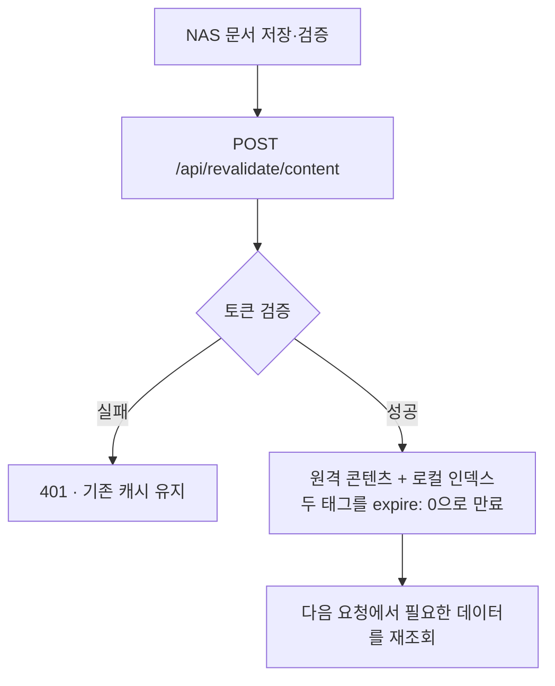

# Docs 캐시 구조: 요청, 서버 메모리, Data Cache

## 개념: 무엇을 얼마나 오래 공유하는가

검토일: 2026-10-03. `apps/docs`의 검색 인덱스 구현을 기준으로 설명한다. 로컬 production 검증과 실제 운영 배포 여부는 [검증 보고서](../../verification/cache/2026-10-03-local-search-index-cache.md)에서 구분한다.

캐시는 이전 계산 결과를 재사용하는 방법이다. 하지만 같은 이름 아래에 서로 다른 저장 범위가 있다. 다음 그림은 범위 비교이며 실제 요청이 세 캐시를 차례대로 통과하는 파이프라인이 아니다.

| 구분                  | 저장 대상 예시                                  | 공유 범위                                                                 | 갱신 방식                             | 현재 사용                                     |
| --------------------- | ----------------------------------------------- | ------------------------------------------------------------------------- | ------------------------------------- | --------------------------------------------- |
| React `cache()`       | 같은 함수·인자로 계산한 결과                    | 서버 React 렌더 요청 하나                                                 | 다음 렌더 요청에서 새로 계산          | 요청 계측 정보와 일부 상세 로더               |
| 직접 만든 메모리 캐시 | 모듈의 `Map`, 저장한 Promise                    | 서버 프로세스 하나                                                        | 직접 삭제·TTL 구현 또는 프로세스 종료 | 검색 인덱스 대안으로 검토했으나 채택하지 않음 |
| Next.js Data Cache    | `unstable_cache` 함수 결과, 캐시한 `fetch` 응답 | 요청 간 공유, 인스턴스 간 공유·보존 범위는 배포 플랫폼/저장소에 따라 다름 | TTL·태그 무효화·캐시 키 변경          | 로컬 검색 인덱스와 원격 콘텐츠                |

### React cache가 해결하는 문제

동일한 서버 React 렌더에서 metadata와 page가 같은 데이터를 요구할 때 중복 계산을 줄인다. 같은 memoized 함수와 같은 인자를 사용해야 한다. 다음 사용자 요청까지 데이터를 보관하는 저장소는 아니다.

[요청 계측 코드](../../../apps/docs/lib/request-observation.ts)는 `cache()`로 요청 ID와 측정 함수를 묶는다. 이 계측 정보는 로컬 인덱스의 지속 캐시 안에 저장하지 않는다. Route Handler처럼 React 렌더 밖의 호출에 동일한 memoization이 보장된다고 일반화하지 않는다.

### 직접 만든 메모리 캐시가 어려운 이유

서버 A에서 `Map.clear()`를 호출해도 B의 Map은 비워지지 않는다. 서버리스에서는 인스턴스가 늘거나 사라지므로 메모리 유지 기간도 고정되지 않는다. 하나의 프로세스에서는 유용하지만 여러 인스턴스의 게시 갱신에는 별도의 무효화 전달 설계가 필요하다.

Data Cache도 내부적으로 메모리를 활용할 수 있다. 여기서 비교하는 것은 물리적 저장 매체가 아니라 앱이 직접 소유한 Map과 프레임워크가 제공하는 캐시의 책임 경계다.

## 프로젝트에서 배운 점: 검색 흐름

현재 검색은 로컬 조회 → 원격 조회 → 병합 → 순위 계산 순서로 실행한다. 원격 목록 조회는 `includeRemote`가 활성화된 경우에만 수행한다. 두 데이터의 캐시를 분리하며 최종 검색 결과를 캐시하지 않는다.

로컬 목록은 원격 조회 중에도 유지한다. 그림의 미스는 최초 조회 또는 즉시 만료 뒤의 경로를 나타낸다. TTL 자연 만료의 stale 응답·백그라운드 갱신은 그림에서 생략했다.

저장하는 것은 검색 전의 인덱스다. 예를 들어 `React` 요청과 `ARIA` 요청은 같은 로컬 인덱스를 사용하되 각각 다른 순위 계산을 수행한다. 로컬 파일을 다시 읽고 파싱하는 비용만 줄이며 검색 점수와 순위 규칙은 그대로다.

원격 장애 중의 로컬 전용 최종 결과를 병합 캐시로 저장하지 않는다. 원격 복구 후 재조회 경로가 남는다. 기존 원격 성공 캐시가 유효한 경우에는 그 캐시를 사용할 수 있으므로 모든 요청이 NAS에 직접 도달한다는 뜻은 아니다.

구현 책임은 다음과 같이 나뉜다.

| 파일                                                                        | 책임                                                     |
| --------------------------------------------------------------------------- | -------------------------------------------------------- |
| [local-search-index.ts](../../../apps/docs/lib/local-search-index.ts)       | 파일 읽기·공용 파서·공개 상태 필터·로컬 검색 데이터 생성 |
| [local-search-cache.ts](../../../apps/docs/lib/local-search-cache.ts)       | Production 재사용, 개발 bypass, 로컬 태그와 TTL          |
| [local-search-revision.ts](../../../apps/docs/lib/local-search-revision.ts) | 문서 내용·경로 digest 생성, 캐시 사용 조건               |
| [get-search-data.ts](../../../apps/docs/lib/get-search-data.ts)             | 원격 장애 격리·병합·중복 제거·검색 순위·요청 계측        |

## 적용 조건과 주의점: 게시 갱신

웹훅은 저장된 결과를 만료시키는 신호다. 모든 문서를 미리 내려받거나 이미 열린 DOM을 즉시 바꾸는 기능이 아니다. 인증·응답 계약은 기존 게시 웹훅과 동일하다.

- 로컬 태그: `docs-content:local-search`.
- 원격 태그: `docs-content:remote`.
- 정상 웹훅 뒤 다음 조회는 만료된 데이터의 새 로딩을 기다린다.
- TTL 300초는 강제 반영 시한이 아니다. 시간 만료는 stale-while-revalidate 동작일 수 있다.
- 개발 환경에서는 로컬 인덱스 캐시를 우회해 파일 변경을 다시 읽는다.
- 로컬 파싱 오류를 빈 인덱스로 저장하지 않는다. 원격 실패의 fallback과 로컬 파싱 실패는 다른 처리다.

### NAS 수정과 로컬 글 수정은 다르다

| 글 위치                 | 파일 변경을 프론트에 전달하는 방법                                   |
| ----------------------- | -------------------------------------------------------------------- |
| NAS의 원격 글           | backend 응답 확인 → 인증된 웹훅 → 다음 요청에서 새 원격 응답         |
| 저장소에 포함한 로컬 글 | 파일 수정 → 새 빌드·배포 → 변경된 문서 digest를 사용하는 로컬 인덱스 |

웹훅으로 NAS 파일이 Vercel 로컬 파일에 복사되지는 않는다. 로컬 fixture 파일을 바꾸는 통합 테스트는 캐시 무효화 검사 수단이지 실제 배포 파일을 원격 편집하는 기능이 아니다.

빌드 digest는 자동 생성하는 `DOCS_LOCAL_SEARCH_REVISION`에 주입한다. 토큰이 아닌 내용 식별자이며 직접 설정할 환경 변수가 아니다. next.config의 `env` 값은 bundle에 포함될 수 있으므로 이 위치에 비밀값이나 원문을 넣지 않는다.

### 함께 헷갈리기 쉬운 다른 캐시

React 렌더 중의 GET `fetch` 요청 memoization도 요청 내 중복 제거다. 요청 간 저장인 Data Cache와 구분한다. 또한 페이지 결과를 저장하는 Full Route Cache, 브라우저의 Router Cache, HTTP·이미지 캐시는 다른 층이다. 서버 데이터가 만료됐다는 사실만으로 열린 브라우저 화면·이미지까지 모두 바뀌었다고 판단하지 않는다.

현재 그림은 검색의 서버 데이터 흐름만 다룬다. Vercel 운영 효과·TTL 만료·브라우저 갱신은 각각 별도의 검증 대상이다.

## 관련 정책과 절차

- [ADR-0011: 로컬 인덱스 재사용 선택 이유](../../architecture/adr-0011-local-search-index-cache.md)
- [콘텐츠 캐시와 게시 갱신 정책](../../architecture/docs-content-cache-revalidation-policy.md)
- [격리 production 캐시 검사 절차](../../runbooks/docs-content-cache-production-test.md)
- [로컬 검색 캐시 검증 결과와 한계](../../verification/cache/2026-10-03-local-search-index-cache.md)
- [기존 모델과 Cache Components 비교](next-cache-components-comparison.md)
- [Data Cache 통합 실험 노트](next-data-cache-integration-lab.md)
